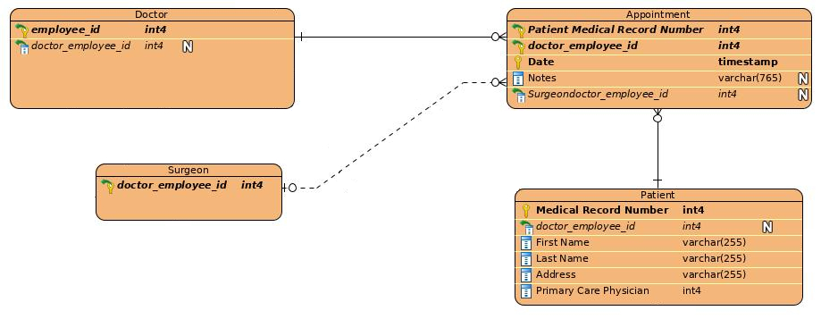

# ER Diagram 

{ width=100% }

\newpage
# Model Overview 

I chose to model a simple hospital. The mini-world includes the entities Patient, Employee (Doctor, Nurse, Secretary), Surgeon,  Room, Procedure, Medication Employee Phone Number and Patient Phone Number. I chose to keep the model fairly general knowing that I would not be able to include __all__ the details of a full hospital. 

Some of the design decisions I made included allowing patients to have multiple phone numbers. I did this through a multivalued attribute called "Patient Phone Number" in a separate table. I also chose to make the various employees into a disjoint hierarchy in order to maintain that nurses, secretaries, and doctors all have unique employee ids. In order to allow doctors to be treated by other doctors when they need medical attention themselves, I gave the doctor entity a reflexive relationship. This way a doctor can have another doctor in the hospital be their primary care physician. 

I also made some assumptions in this model such as in the appointment relationship. I assume that patients can be enrolled in the system without having made an appointment yet. The relationship is therefore zero to many for the patient. Similarly new doctors and new surgeons do not have to have any appointments. I also assumed that every patient has at least one phone number and a first and last name. These attributes require at least one and are not nullable.

# Description of an Entity Type and Relationship Type 

**Patient** is one of the main entities in the model and arguably the most important in a hospital. They are the whole reason to create a hospital system. The patient has six attributes: Medical Record Number, Doctor Employee ID, First Name, Last Name, Address, and Phone Number. The Patient entity borrows the Doctor entity's Employee as Doctor Employee ID as a foreign key. This foreign key creates the Primary Care Physician relationship between the Patient and a Doctor. A patient has exactly one primary care physician and a doctor can be the primary care physician for many patients. The First and Last Name attribute is a composite attribute. This way the hospital can more easily generate friendly sounding emails to patients. The patients can keep multiple phone numbers on file with the hospital so this attribute is multivalued and resides in its own table called Patient Phone Number. 

**Prescription** is a relationship that keeps record of prescriptions prescribed to patients. The Prescription is identified by the Patient Medical Record Number, Doctor Employee ID who prescribed it, the Mediation Name, and Date of prescription. The first three attributes are borrowed foreign keys from a Patient, Doctor, and Medication respectively. Optionally, a doctor can add notes and a quantity for the prescription.

\newpage
# Model Requirements 

1. Many - One relationship, **total** participation on the **one** side.

Doctors and appointments have a many to one relationship with total participation on the one side. A doctor can participate in zero to many appointments but every appointment must participate with exactly one doctor.

{ width=100% }

2. Many - Many relationship

The nurse and room entities have a many to many relationship through on call. When a nurse is on call they cover many rooms and a room can be part of many different nurses' on call shift.

{ width=100% }

3. Ternary relationship

The prescription relates the doctor, patient, and medicine entities. A prescription is identified by the doctor's employee id who wrote the prescription, the patient's medical record number who received the prescription, the brand name of the medication that was prescribed, and the date it was prescribed on.

{ width=100% }

4. Disjoint inheritance hierarchy

The employees form a disjoint hierarchy of doctors, nurses, and secretaries. An employee can only fit into one of these categories.

{ width=75% }

5. Overlapping inheritance hierarchy

Doctors and Surgeons for an overlapping hierarchy. A doctor can be a surgeon and a regular doctor.

{ width=50% }

6. Composite attribute

Patient, and employee (nurse, secretary, doctor) entities have a name attribute that is a composite attribute. Each name has a `first` and `last` name.

{ width=50% }

7. Multivalued attribute

The patient entity can have multiple phone numbers one file: ex Cell and Mobile. The phone numbers are stored in a separate table using the patient's medical record number as a foreign key.

{ width=100% }

8. One - One relationship, **total** participation on **at least** one side

A doctor has one office and an office is assigned to one doctor. Every doctor is assigned an office, total participation, but offices can be empty, partial participation.

{ width=100% }

9. One - Many relationship, **partial** participation on **both** sides

Surgeons can have many appointments with patients before their procedure is performed and an appointment can involve a surgeon if it is a pre-operation appointment. However, newly hired surgeons do not have any appointments. Therefore surgeons can be involved in zero to many appointments, and an appointment can be related to zero or one surgeon.

{ width=100% }

10. Relationship with an attribute(s)

Prescription is a relationship with attributes. It relates a doctor, patient and medicine but additionally has the attributes `date`, `notes`, and `quantity`

{ width=50% }

11. Weak-Entity

The appointment entity is a weak entity. It borrows the patient medical record number and doctor employee ID to form its key along with the date.

{ width=100% }

12. Reflexive relationship

Doctors need to see doctors so they have a reflexive relationship. A doctor can be the primary care physician for many doctors and a doctor has exactly one primary care physician which is a doctor.

{ width=50% }

\newpage
# Physical Schema 

```{sql}
CREATE TABLE Doctor (
  employee_id int4 NOT NULL,
  doctor_employee_id int4,
  PRIMARY KEY (employee_id));
CREATE TABLE Patient (
  "Medical Record Number" SERIAL NOT NULL,
  doctor_employee_id int4,
  "First Name" varchar(255) NOT NULL,
  "Last Name" varchar(255) NOT NULL,
  Address varchar(255) NOT NULL,
  "Primary Care Physician" int4 NOT NULL,
  PRIMARY KEY ("Medical Record Number"));
CREATE TABLE Medication (
  Name varchar(255) NOT NULL,
  Formula varchar(255) NOT NULL,
  Cost float4,
  PRIMARY KEY (Name));
CREATE TABLE Perscription_Patient (
  "PatientMedical Record Number" SERIAL NOT NULL,
  PRIMARY KEY ("PatientMedical Record Number"));
CREATE TABLE Prescription (
  "Patient Medical Record Number" int4 NOT NULL,
  doctor_employee_id int4 NOT NULL,
  "Medication Name" varchar(255) NOT NULL,
  "Date" timestamp NOT NULL,
  Notes varchar(511),
  Quantity int4,
  PRIMARY KEY ("Patient Medical Record Number", doctor_employee_id, "Medication Name", "Date"));
CREATE TABLE Appointment (
  "Patient Medical Record Number" int4 NOT NULL,
  doctor_employee_id int4 NOT NULL,
  "Date" timestamp NOT NULL,
  Notes varchar(765),
  Surgeondoctor_employee_id int4,
  PRIMARY KEY ("Patient Medical Record Number", doctor_employee_id, "Date"));
CREATE TABLE "Procedure" (
  Name varchar(255) NOT NULL,
  Cost numeric(2, 0) NOT NULL,
  PRIMARY KEY (Name));
CREATE TABLE Room (
  "Room Number" int4 NOT NULL,
  Ward varchar(255) NOT NULL,
  doctor_employee_id int4,
  PRIMARY KEY ("Room Number", Ward));
CREATE TABLE "Procedures Performed" (
  ProcedureName varchar(255) NOT NULL,
  "PatientMedical Record Number" int4 NOT NULL,
  doctor_employee_id int4 NOT NULL,
  "RoomRoom Number" int4 NOT NULL,
  RoomWard varchar(255) NOT NULL,
  "Date Admitted" date NOT NULL,
  "Date Discharged" date NOT NULL,
  Notes varchar(1000),
  PRIMARY KEY (ProcedureName, "PatientMedical Record Number", doctor_employee_id));
CREATE TABLE Nurse (
  employee_id int4 NOT NULL,
  PRIMARY KEY (employee_id));
CREATE TABLE Secretary (
  employee_id int4 NOT NULL,
  PRIMARY KEY (employee_id));
CREATE TABLE "Patient Phone Number" (
  "PatientMedical Record Number" int4 NOT NULL,
  "Country Code" varchar(2) NOT NULL,
  "Area Code" char(3) NOT NULL,
  "Phone Number" varchar(7) NOT NULL,
  Type varchar(7) NOT NULL,
  PRIMARY KEY ("PatientMedical Record Number", "Country Code", "Area Code", "Phone Number"));
CREATE TABLE "On Call" (
  nurse_employee_id int4 NOT NULL,
  "RoomRoom Number" int4 NOT NULL,
  RoomWard varchar(255) NOT NULL,
  "Start Time" time(6) NOT NULL,
  "End Time" time(6) NOT NULL,
  PRIMARY KEY (nurse_employee_id, "RoomRoom Number", RoomWard));
CREATE TABLE Employee (
  employee_id SERIAL NOT NULL,
  "First Name" varchar(255) NOT NULL,
  "Last Name" varchar(255) NOT NULL,
  PRIMARY KEY (employee_id));
CREATE TABLE Shift (
  secretary_employee_id int4 NOT NULL,
  Ward varchar(255) NOT NULL,
  "Start Time" time(6) NOT NULL,
  "End Time" time(6) NOT NULL,
  PRIMARY KEY (secretary_employee_id, Ward));
CREATE TABLE Surgeon (
  doctor_employee_id int4 NOT NULL,
  PRIMARY KEY (doctor_employee_id));
CREATE TABLE "Can Perform" (
  ProcedureName varchar(255) NOT NULL,
  doctor_employee_id int4 NOT NULL,
  PRIMARY KEY (ProcedureName, doctor_employee_id));
CREATE TABLE "Employee Phone Number" (
  employee_id int4 NOT NULL,
  "Country Code" varchar(2) NOT NULL,
  "Area Code" char(3) NOT NULL,
  "Phone Number" varchar(7) NOT NULL,
  Type varchar(7) NOT NULL,
  PRIMARY KEY ("Country Code", "Area Code", "Phone Number"));
ALTER TABLE Prescription ADD CONSTRAINT FKPrescripti883479 FOREIGN KEY (
  doctor_employee_id) REFERENCES Doctor (employee_id);
ALTER TABLE Prescription ADD CONSTRAINT FKPrescripti863884 FOREIGN KEY (
  "Medication Name") REFERENCES Medication (Name);
ALTER TABLE Prescription ADD CONSTRAINT FKPrescripti918383 FOREIGN KEY (
  "Patient Medical Record Number") REFERENCES Patient ("Medical Record Number");
ALTER TABLE Appointment ADD CONSTRAINT FKAppointmen169669 FOREIGN KEY (
  "Patient Medical Record Number") REFERENCES Patient ("Medical Record Number");
ALTER TABLE Appointment ADD CONSTRAINT FKAppointmen632194 FOREIGN KEY (
  doctor_employee_id) REFERENCES Doctor (employee_id);
ALTER TABLE Patient ADD CONSTRAINT "Primary Care Physician" FOREIGN KEY (
  doctor_employee_id) REFERENCES Doctor (employee_id);
ALTER TABLE Room ADD CONSTRAINT Office FOREIGN KEY (
  doctor_employee_id) REFERENCES Doctor (employee_id);
ALTER TABLE Doctor ADD CONSTRAINT FKDoctor853760 FOREIGN KEY (
  doctor_employee_id) REFERENCES Doctor (employee_id);
ALTER TABLE "Procedures Performed" ADD CONSTRAINT FKProcedures631041 FOREIGN KEY (
  ProcedureName) REFERENCES "Procedure" (Name);
ALTER TABLE "Procedures Performed" ADD CONSTRAINT FKProcedures597394 FOREIGN KEY (
  "PatientMedical Record Number") REFERENCES Patient ("Medical Record Number");
ALTER TABLE "Procedures Performed" ADD CONSTRAINT FKProcedures612949 FOREIGN KEY (
  "RoomRoom Number", RoomWard) REFERENCES Room ("Room Number", Ward);
ALTER TABLE "On Call" ADD CONSTRAINT "FKOn Call165231" FOREIGN KEY (
  nurse_employee_id) REFERENCES Nurse (employee_id);
ALTER TABLE "On Call" ADD CONSTRAINT "FKOn Call393327" FOREIGN KEY (
  "RoomRoom Number", RoomWard) REFERENCES Room ("Room Number", Ward);
ALTER TABLE Secretary ADD CONSTRAINT FKSecretary746869 FOREIGN KEY (
  employee_id) REFERENCES Employee (employee_id);
ALTER TABLE Nurse ADD CONSTRAINT FKNurse43210 FOREIGN KEY (
  employee_id) REFERENCES Employee (employee_id);
ALTER TABLE Doctor ADD CONSTRAINT FKDoctor682800 FOREIGN KEY (
  employee_id) REFERENCES Employee (employee_id);
ALTER TABLE Shift ADD CONSTRAINT FKShift328598 FOREIGN KEY (
  secretary_employee_id) REFERENCES Secretary (employee_id);
ALTER TABLE "Can Perform" ADD CONSTRAINT "FKCan Perfor475947" FOREIGN KEY (
  ProcedureName) REFERENCES "Procedure" (Name);
ALTER TABLE "Patient Phone Number" ADD CONSTRAINT "FKPatient Ph972231" FOREIGN KEY (
  "PatientMedical Record Number") REFERENCES Patient ("Medical Record Number");
ALTER TABLE "Employee Phone Number" ADD CONSTRAINT "FKEmployee P444894" FOREIGN KEY (
  employee_id) REFERENCES Employee (employee_id);
ALTER TABLE "Can Perform" ADD CONSTRAINT "FKCan Perfor545313" FOREIGN KEY (
  doctor_employee_id) REFERENCES Surgeon (doctor_employee_id);
ALTER TABLE Appointment ADD CONSTRAINT FKAppointmen183506 FOREIGN KEY (
  Surgeondoctor_employee_id) REFERENCES Surgeon (doctor_employee_id);
ALTER TABLE "Procedures Performed" ADD CONSTRAINT FKProcedures319288 FOREIGN KEY (
  doctor_employee_id) REFERENCES Surgeon (doctor_employee_id);
ALTER TABLE Surgeon ADD CONSTRAINT FKSurgeon50578 FOREIGN KEY (
  doctor_employee_id) REFERENCES Doctor (employee_id);
```
