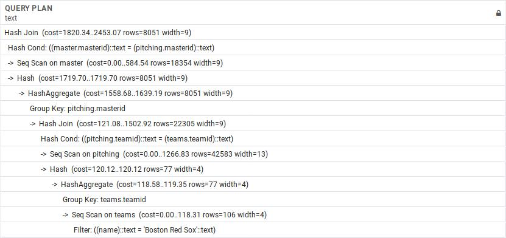

# 1. Aggregate optimization
```{sql}
SELECT max(G_p)
FROM appearances;
```

{ width=75% }

The initial cost was 2666.84.

My first attempt to improve this query was to write it as a sorted selection of the `G_p` column then only display one row.

```{sql}
SELECT G_p
FROM appearances
ORDER BY G_p DESC
LIMIT 1;
```

{ width=75% }

The cost was, 2912.19, which was 9.2% higher than the original.
Next I created an index on the `G_p` column and ran the original query again which resulted in the query plan below. This time the cost was 0.38 which is a 99.98% decrease!

{ width=75% }

# 2. Group by optimization
```{sql}
SELECT yearID, teamID, max(HR)
FROM batting
GROUP BY yearID, teamID;
```

{ width=75% }

The cost of the original query is 3340.95. I don't think this query can be optimized. I tried creating multiple different index types, changing the order of the aggregation and preselecting the rows affected and I never saw a decrease in total cost. It makes sense that the whole table has to be scanned to find the maximum HR values, and them associate them with a year and team id. All steps in the query execution plan are necessary.

# 3. Distinct
```{sql}
SELECT distinct nameFirst, nameLast
FROM master
```

{ width=75% }

The cost of the original query is 771.53. First I created an index on `master(nameFisrt, nameLast)` which did not alter the query plan. This makes sense because this index would not provide any advantage over a linear scan on the master table. I couldn't think of simpler way to rewrite the query.

# 4. Selection
```{sql}
SELECT *
FROM appearances
WHERE g_all > 60
```

The original const of the query was 2666.82. I created an index on `appearances(g_all)` which reduced the cost to 2434.80. Then I created a second index on `appearances(g_all) where g_all > 60` which further reduced the cost to 2363.48. I couldn't find a way to rewrite the query that produces a lower cost that the original plan.

# 5. Selection conjunction
```{sql}
SELECT *
FROM appearances
WHERE g_all > 60 AND g_batting < 4
```

{ width=75% }

The cost of the original query is 2912.19. Creating an index on `appearances(g_all, g_batting)` produced the following query plan and reduced the cost by 24.5% to 2197.64.

{ width=75% }

I was able to decrease the cost by 46.9% from the original cost to 1546.17 by creating an index on `appearances(g_all, g_batting) where g_all > 60 AND g_batting < 4`. This is a very specific index to create so I would not consider this unless this exact query was going to be run frequently.

{ width=75% }

# 6. Selection disjunction
```{sql}
SELECT *
FROM appearances
WHERE g_all > 60 OR g_batting < 4
```
I tried creating an index on `appearances(g_all)` and `appearances(g_batting)` but postgres didn't use it. I tried reordering the conditionals with no change. I tried selecting `g_all > 60` and `g_batting < 4` separately, then selecting the common rows between them, but that produced query plan with a giant cost, greater than 12000. The only index that I found to make a difference was one on `appearances(g_all, g_batting) where g_all > 60 OR g_batting < 4` which produced a query plan that cost 2815.58.

# 7. Equi-join
```{sql}
SELECT *
FROM master, appearances, teams
WHERE master.masterId = appearances.masterId
  AND teams.teamId = appearances.teamId
  AND teams.yearId = appearances.yearId
```

{ width=75% }

The cost of the original query is 9541.10. My attempt to rewrite the query with the join syntax below resulted in the same exact query plan which confirms to me that `JOIN` and `WHERE` clauses have the same effect on query planning.

```{sql}
SELECT *
FROM master JOIN appearances ON master.masterId = appearances.masterId
JOIN teams
on teams.teamId = appearances.teamId
AND teams.yearId = appearances.yearId
```

Creating indices on `teams(yearid)`, `teams(teamid)`, `appearances(yearid)`, and `appearances(teamid)` didn't help to produce a different query plan either. I was a little bit surprised by this because I thought having indices to these columns would help improve the join.

# 8. Theta-join
```{sql}
SELECT a.teamid, a.yearid, b.yearid, c.yearid
FROM teams a, teams b, teams c
WHERE a.teamid = b.teamid
  AND b.teamid = c.teamid
  AND a.w > b.w
  AND b.w > c.w
```

I started by creating an index on `teams (teamid)`. This reduced the number of operations in the query execution plan from 7, to 5, and reduced the total cost of the query from 84559.3 to 21843.4 for a cost difference of 62715.87!

# 9. Semi-join
<!--97893 rows-->
```{sql}
SELECT nameLast
FROM master, batting
WHERE master.masterid = batting.masterid
```

{ width=75% }

The cost of the original query is 3579.87. Once again, rewriting the query with the `JOIN` syntax and adding indices to `batting(masterid)` did not change the original query plan.

# 10. Putting it all together
```{sql}
SELECT masterid, yearId, HR
FROM batting B
WHERE HR = (SELECT MAX(HR)
            FROM batting B2
            WHERE B.yearID = B2.yearID
           )
```

I created an index on `batting(yearid)`. The query execution plan was more complex, the sequential scan is replaced with a bitmap heap scan and a bitmap index scan for a total cost of about 13.  Because of this, the aggregation step gets a cost of 1247.5 which is more than a 50% reduction from the non indexed query which had an aggregation cost of 2755.3.  

# 11. Putting it all together two
```{sql}
SELECT masterid
FROM master
WHERE masterID IN
  (SELECT DISTINCT masterID
   FROM pitching
   WHERE teamID IN
     (SELECT DISTINCT teamID
      FROM teams
      WHERE name = 'Boston Red Sox'))
```

 <!--795 rows-->
{ width=75% }

The cost of the original query is 2453.07. Rewriting the query as a series of joins made the query cost increase to 4887.89.

```{sql}
select distinct m.masterid
from master m join pitching p
  on m.masterid = p.masterid
join teams t
  on p.teamid = t.teamid
where t.name = 'Boston Red Sox'
```

{ width=75% }

Then I realized that the query was doing the same work twice in the outermost queries so I rewrote it as follows and got an 11.1% decrease to 2181.62.

```{sql}
SELECT DISTINCT masterID
   FROM pitching
   WHERE teamID IN
     (SELECT DISTINCT teamID
      FROM teams
      WHERE name = 'Boston Red Sox')
  order by 1 asc
```

{ width=75% }
