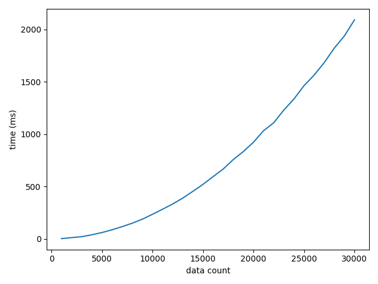

## 1
<!-- 1. If we try to parallelize the for i loop (the outer loop), which variables should be private and which should be shared? (5 points) -->
When parallelizing the outer loop, the variables `i`, `j`, and `count` should be private and `a`, `n`, and `temp` should be shared.

## 2
<!-- 2. Can we parallelize the call to memcpy? If so, how can we do this? If not, can we modify the code so that this operation will be parallelizable? (5 points) -->
The call to `memcpy` can not be parallelized as it is written. This would result in the sorted array being copied in its entirety by each thread. Instead, each thread can copy a chunk of the data in the following manner.

```c++
const int rank = omp_get_thread_num();
const int n_per_thread = n / thread_count;
const int start = rank * n_per_thread;
const int my_n = (rank == thread_count - 1) ? n - (rank * n_per_thread) : n_per_thread;
memcpy(a + start, temp + start, my_n * sizeof(int));
```

It is important to only free `temp` in one thread by putting it outside of the parallel context.

## 3

I implemented two versions of the parallel count sort algorithm. The first is a modern c++ implementation based on iterators, the second parallelizes the code given in the assignment description.

This project includes a CMakeLists.txt with three projects: count_sort, count_sort_benchmark and tests. The project count_sort requires command line arguments for number of threads, data count, and optionally a seed for the pseudo random number generator (default 100). It generates a sequence of integers, prints the original sequence, and then the sorted sequence to stdout. The pseudo random number generator, `std::rand`, was seeded with 100 for each trial. The following commands will build and run the count_sort project.

```bash
mkdir build
cd build
cmake -DCMAKE_BUILD_TYPE=Release ..
make count_sort
./count_sort/count_sort 4 25

# [ 16, 2, 5, 10, 7, 24, 6, 21, 7, 22, 6, 4, 23, 23, 16, 2, 6, 14, 11, 19, 20, 17, 13, 16, 7 ]
# [ 2, 2, 4, 5, 6, 6, 6, 7, 7, 7, 10, 11, 13, 14, 16, 16, 16, 17, 19, 20, 21, 22, 23, 23, 24 ]
```

### Timing results

Unsurprisingly this algorithm has a time complexity of $O(n^2)$ which can clearly be seen in Figure \ref{data_count}.

Question 2 asked to parallelize the copying of the sorted temporary array. I found that this portion of the algorithm was taking approximately $0.001\%$ of the total runtime. After parallelization, performance suffered slightly, see Figure \ref{move_compare} (my version) and Figure \ref{memcpy_compare} (given code). The difference is so little it likely falls within the margin of error. These tests were run with a 20 trial average on 10,000 elements.

I also experimented with the static scheduling chunksize. Figure \ref{chunksize_1-100} and Figure \ref{chunksize_1-1000} show timings results for 8 threads on 10,000 elements for chunk sizes from 1 to 100 and 1 to 1,000 by 10 respectively. It's interesting to see how some chunksizes are significantly worse and how the trend does not increase monotonically.

{ width=50% }

\begin{figure}[H]
\centering

\begin{minipage}{.5\textwidth}
  \centering
  \includegraphics[width=\linewidth]{parallel_move_compare.png}
  \caption{Parallelization of outer loop and move}
  \label{move_compare}
\end{minipage}%
\begin{minipage}{.5\textwidth}
  \centering
  \includegraphics[width=\linewidth]{parallel_memcpy_compare.png}
  \caption{Parallelization of outer loop and memcpy}
  \label{memcpy_compare}
\end{minipage}
\end{figure}

\begin{figure}[H]
\centering

\begin{minipage}{.5\textwidth}
  \centering
  \includegraphics[width=\linewidth]{chunksize_1-100.png}
  \caption{Static Scheduling with Chunksize 1-100}
  \label{chunksize_1-100}
\end{minipage}%
\begin{minipage}{.5\textwidth}
  \centering
  \includegraphics[width=\linewidth]{chunksize_1-1000.png}
  \caption{Static Scheduling with Chunksize 1-1000}
  \label{chunksize_1-1000}
\end{minipage}
\end{figure}
