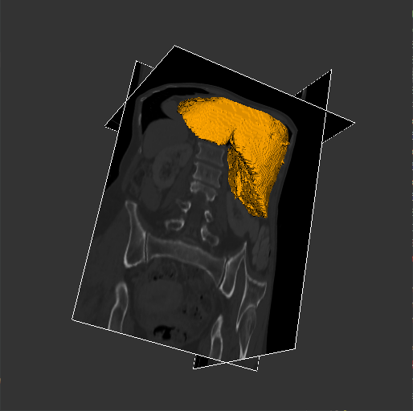

# Part 1

## Question 1

### A

In the Honolulu dataset, ParaView assigns the polygonal mesh datatype to the data. This can be seen in the Information tab on the left hand side of the screen. An advantage of the polygonal mesh data type is that it can have a dynamic resolution. More vertices can be sampled around areas of interest. A disadvantage to polygonal mesh is the data is not aligned in memory as it is in space. An alternative datatype could have been a height map with each scalar entry representing the height of the terrain. This data format would be faster to access random points selected from the geometry.

### B

I applied a calculator filter and selected only the Z component of each node in the mesh. This created a height map I was able to color.

### C

I selected an isovalue of 711 to create contours around the three tallest peaks.

## Question 2

### A

In the head CT scan dataset, ParaView assigns the Image (Uniform Rectilinear Grid) to the data.

### B

I used the histogram to decrease the opacity in ranges of the space that had the most values in the histogram. I found it very convenient to use the histogram built into the colormap display when choosing ranges to decrease alpha.

### C

For each isovalue, I used the middle value of the colormap ranges to isolate skin, skull, and teeth. I used the following isovalues for skin, skull, and teeth respectively: 800, 1600, and 3300.

### D

Here I have split the view to display the volume render in the top left, the isocontour render on the right, and the 3-axis slice view in the bottom left.

# Part 2

## A

I created a plan data source in the YZ plane with a resolution of 100 x 10. I used this plane source to seed a StreamTracesWithCustomSource. This allowed me to distribute points through the hurricane and produce this compelling visualization.

## B

I added glyphs to the stream line filter to visualize the direction of the wind in the hurricane. I added a glyph every 3000 points along each streamline.

## C

I added glyphs to the volume to get an overall sense fo the direction the wind flow withing the hurricane. This time I used a uniform spacial distribution of 1000 points to place the glyphs.

# Part 3

## Question 1

I used spheres to represent the atoms and the radius of the sphere is determined by the radius of the atom. The tubes connecting the spheres represent the connections between atoms.

## Question 2

### A

The isovalue I choose was 255 but it did not matter as long as the isovalue $v$ was $0 < v \leq 255$

### C

bone: $500 \lesssim \rho \leq 3071$

soft tissue: $-125 \lesssim \rho \lesssim 500$

air: $-1024 \leq \rho \lesssim -125$

### D

The key L can be pressed to toggle the liver visibility.

