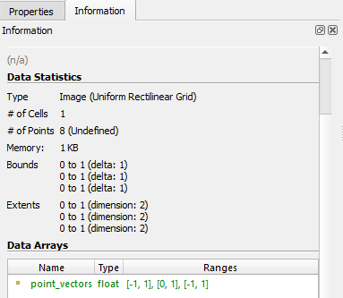
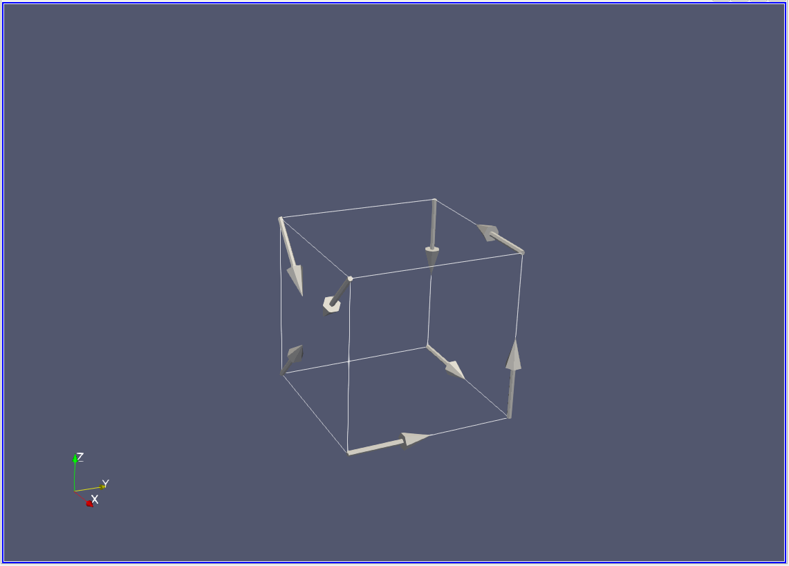
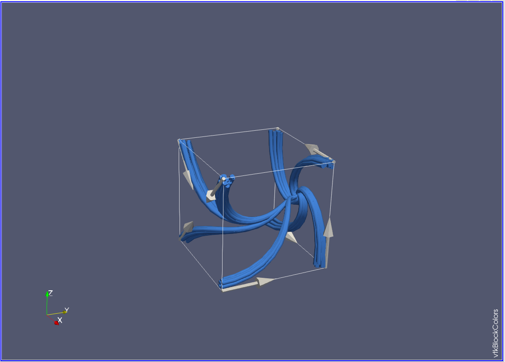
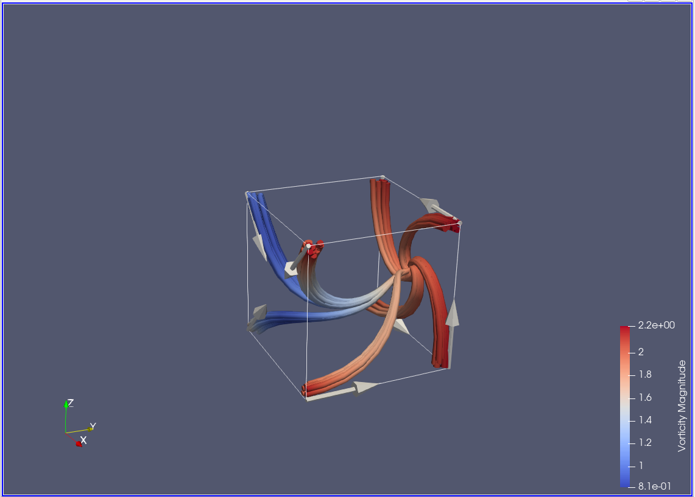
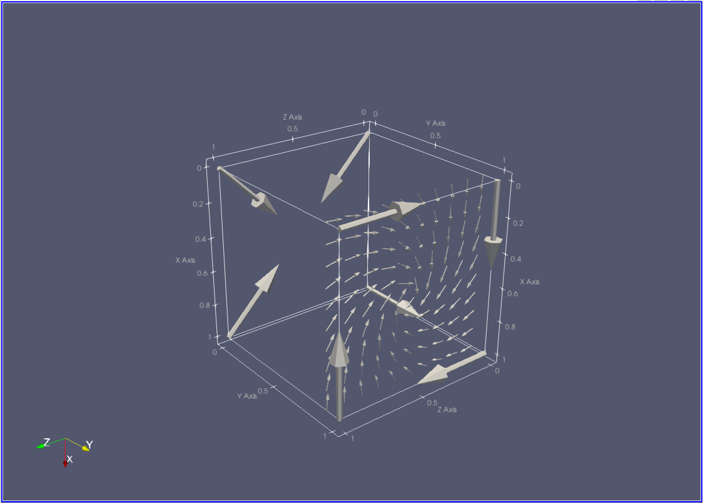
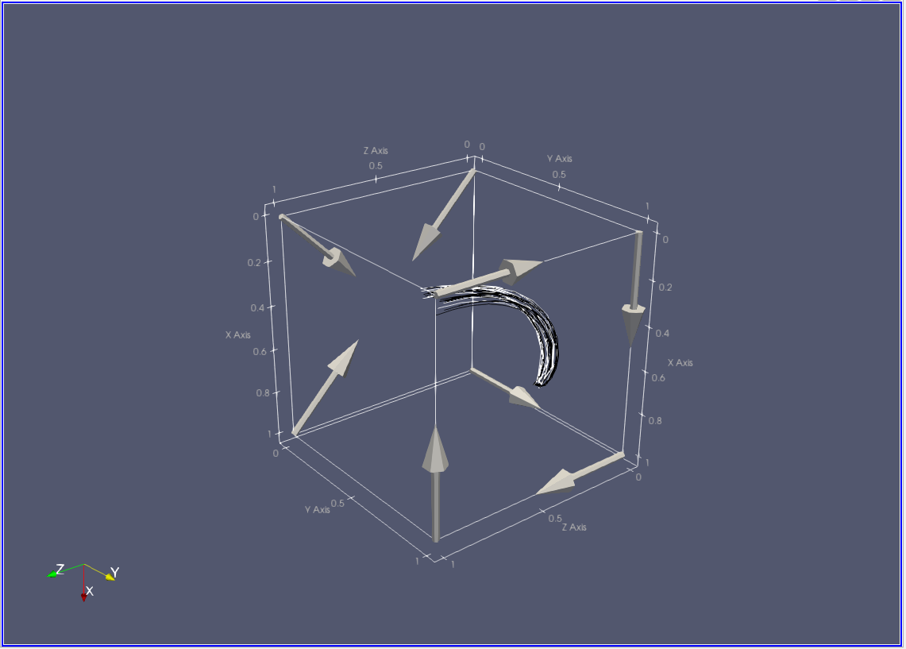

# Part 1. Volume Rendering

## 1
Examples of direct rendering are

- ray casting with compositing
- splatting

Examples of indirect rendering are

- rendering an iso surface
- rendering streamlines

## 2
When directly rendering a volume with ray casting, samples are taken along each ray using regular sampling, scan conversion, or voxel intersection. A few strategies can be used to composite the samples:

- first: take the first value
- min/max: take the lowest/highest value
- average: average the values together
- accumulate: use a transfer function for color/opacity

## 3
The first compositing scheme will produce an image that looks similar to an iso surface because it will display only the values just below the threshold as if the threshold value were the iso value.

## 4
Slice based rendering is very fast because it leverages the texture memory of a GPU.

## 5
1. Look at a "cell" which consists of eight values forming the corners of a cube within the dataset
2. Identify each corner of the cell as above or below the iso value
3. Calculate an "index" for the cell, each corner is one bit of the eight bit index, 1 if above the iso value, 0 if below the iso value
4. Use the index to lookup edges in the cell configuration table
5. For each vertex in lookup table, interpolate between the corners of the cell to determine the polygon vertices
6. Add the constructed polygons to a list and move on to the next cell

# Part 2. Paraview

## 1
ParaView assigns the cube dataset the data type Image with Uniform Rectilinear Grid cell type.

## 2
I expect streamlines seeded at the corners of the cube to travel around the center of the cube. I think it will interpolate between the corner values causing the streamlines to swirl inside the cube.

## 3
I had the right idea of where the streamlines would end, however I miss interpreted the effect of the vector along the y-axis which pushed the streams to the right face. I integrated in the FORWARD direction and needed to increase the maximum streamline length.

## 4
The rescale to data range feature sets the lower bound of the transfer function to the minimum value of the data set and the upper bound to the maximum value. This increases the dynamic range of the colors displayed in the visualization which can help highlight important features.

## 5
I resampled the grid to 10 x 1 x 10 to create a 10 x 10 plane at y = 1.

## 6
After resampling to a 10 x 10 grid, the streamlines on the course mesh needed to have a step size four times smaller to attain results similar to the resampled mesh. In the figure below, the black streamlines are on the resampled mesh and the white streamlines are on the course mesh. I also needed to increase the y dimension of the resample filter to 5 so that there would be depth to that layer for the streamlines to travel in. Without this adjustment, the streamlines would travel straight out of the vertex, unaffected by the field.

# Part 3. VTK

## Keyboard Interface

Manipulating the streamlines

- Use the arrow keys to move seed point 1
- Hold shift and use the arrow keys to move seed point 2
- Press space to cycle through Forward, Backward, and Both streamline integration directions
- Use "m" and "l" to add more or less streamlines