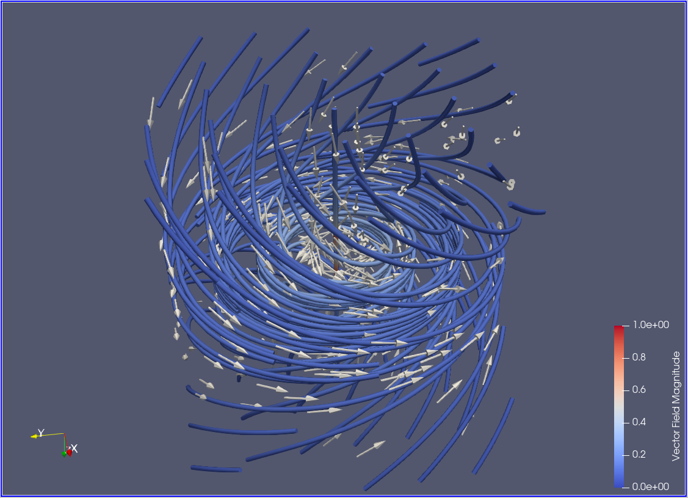

# Part 1. Reading

## 1
In a steady flow, the vector field does not change between time steps. In steady flows, streamlines, streaklines, and pathlines are identical. Unsteady flows change with time and so streamlines, streaklines and pathlines are not identical.

## 2
Streamlines are drawn for each time step and are tangent to the vector field at all points.

Streaklines trace the same path that dye would traverse if it were released into the flow at a fixed position.

Pathlines are similar to streamlines, however, they show the motion of particles over time through a vector field.

Timelines show the motion of sets of particles connected with a line over time.

## 3
Three classifications of vector field visualization are point-based, curve-based, and feature-based. Point-based visualizations use the vector field at a point to generate the visualization. The vector field is mapped to glyphs and no intermediate processing of data is performed. Curve-based visualizations are obtained by tracing particles through the field. Feature-based visualizations thoroughly preprocesses data to identify important features, which then serve as a basis for the actual visualization

<!-- Three classifications of vector field visualization are local methods, texture-based methods, and topology-based methods. Local methods, such as streamlines, can only visualize the flow directions initiated from one or a few particles. Texture-based methods, such as the line integral convolution, use the vector field to manipulate a noise function and smear it throughout the field. Topology-based methods map the field to a 3D object, warping it. -->

<!-- Three kinds of vector field visualization are glyph-based methods, texture-based methods, and displacement-based methods. Glyph-based methods place glyphs, such as arrows, in the vector field and orient them such that they point in the direction of the field at each point. Texture-based methods, such as the line integral convolution, use the vector field to manipulate a noise function and smear it throughout the field. Displacement-based methods map aspects of the field to a 3D object, warping it, and visualizing it's effect. -->

## 4
Critical points, vortices, and shock waves are features identified in feature-based visualizations. There are two classifications of vortex identifying algorithms: point-based, local techniques, and geometry-based, global techniques. Local techniques operate directly on the vector field using the physical quantities in the fluid flow. These techniques are simpler to compute but are more likely to miss some of the vortex features in a flow. Weak vortices which rotate slowly may be hard to detect using these methods. On the other hand, geometric techniques are more computationally intensive but provide improved detection of vortices. Shock waves are an interesting feature to identify in a flow because they increase the drag in a flow and can cause physical damage to materials in the flow. A shock wave is characterized by discontinuities in the physical quantities of the flow such as velocity, pressure, and density. This makes shock wave detection algorithms similar to edge detection algorithms. Feature-based visualizations are important because the remove the burden of feature identification from the user.

# Part 2. Paraview

## 2D Vector Field

## 3D Vector Field

# Part 3. Reading

## A. Summary of Chapter 3

Chapter 3 discusses the extraction of time-dependant isosurfaces. Increases in computational power has lead to simulations being run at higher spatial and temporal resolution in order to analyze complex, dynamic systems. It is important to be able to compute isosurfaces at an interactive speed to enable the exploration of the resulting datasets. This chapter discusses two isosurface data structures the aim to reduce storage overhead while maintaining high search performance. It then moves on to discuss extraction of time-varying isosurfaces in 4D space which allows smooth animation of isosurfaces in time.

The problem the specialized data structures aim to solve is to reduce the overhead storage cost compared to data structures such as octrees, ISSUE, extrema graphs, isocontouring, and interval trees. The extra storage comes from requiring extra search indices. This overhead is allowable for single time-steps, however, when working with a time series in an interactive visualization with many time-steps, the overall storage requirements for these search indices can quickly exceeded the resources of the system. Additionally, the large amount of data in time series datasets can quickly offset the gains from efficient isosurface algorithms with disk I/O.

The two data structures discussed are the temporal hierarchical index tree and the temporal branch-on-need tree. Temporal hierarchical index trees reduce index storage by only keeping track of the minimum and maximum values for each cell over a time range. This way, fewer cells are visited when looking at exact values for a specific time step. Temporal branch-on-need trees is an expansion on the octree which is efficently partitions space allowing for pruning of cells which do not contribute to the isosurface. At each node, the minimum and maximum values of the encompassed cells are stored across all the time steps. When computing an isosurface, if the isovalue does not fall withing the range of a node, all it's children can be safely skipped. The spatial partitioning is improved upon by padding the volume with "virtual zeros" to force the dimensions of the volume to be powers of two. Then an equal subdivision is performed. This makes the lower half of the subdivision in each dimension dover the largest possible power of two voxles. Since the spatial dimensions are assumed to remain constant throughout the time steps, only one tree is required to maintain the spatial partitions. Each time step can be stored on the nodes.

## B. 

I thought that the marching cube algorithm was going to be a very efficient algorithm for constructing isosurfaces. I had not thought about how much time is wasted on cells that are well above or below the isovalue. These techniques helped show me how much faster the isosurface can be extracted if a little organization is made beforehand. This is especially true in time-series and interactive visualizations where isosurfaces are going to be calculated many times. The construction of specialized data structures one time can boost the performance of isosurface extraction every time a new value or time step are used.

## C.

The new innovations described in the chapter are temporal hierarchical index trees and the temporal branch-on-need trees. These data structures reduce storage overhead while maintaining high search performance for extracting isosurfaces from time-series data sets.

## D.

The weakness of the temporal branch-on-demand tree is that it requires more information for an efficient isosurface search. By making the tree more specialized, it can not be shared with other visualizations compared to using an unmodified octree.