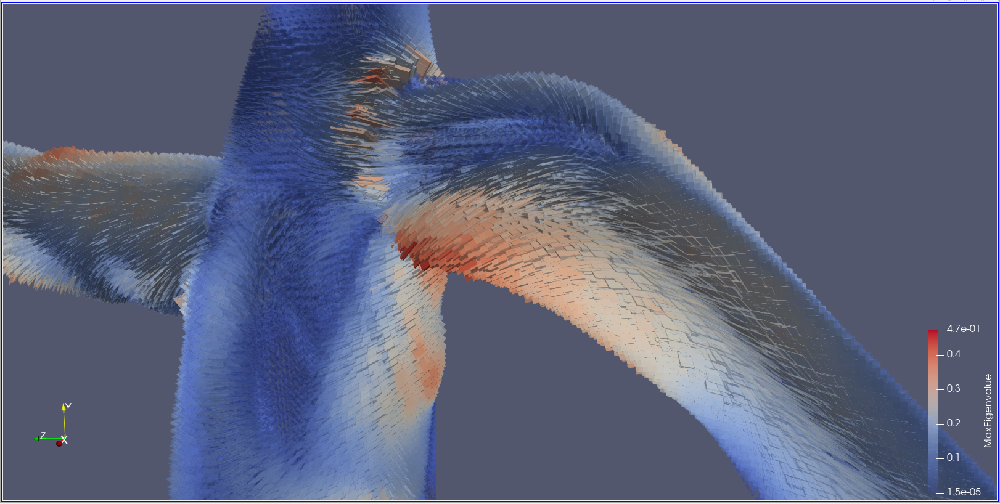
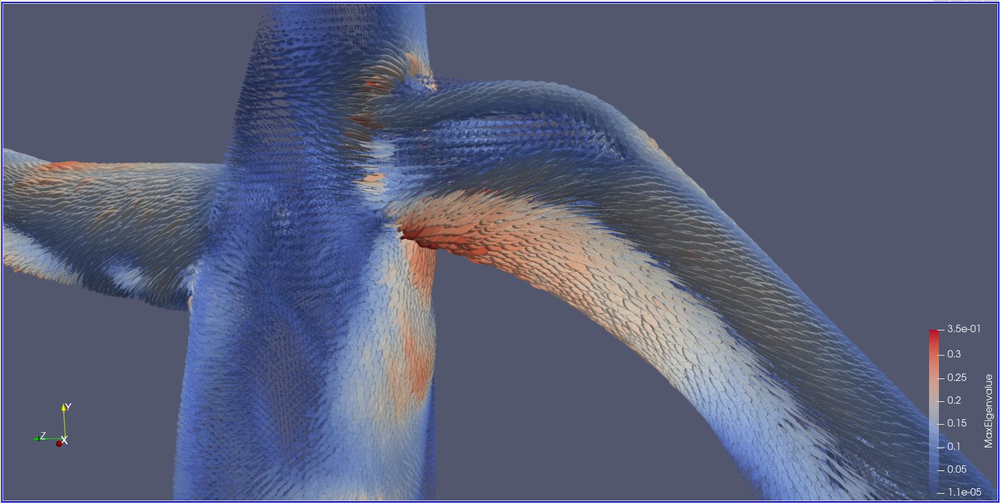
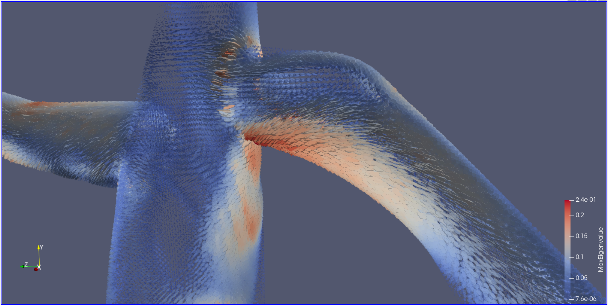
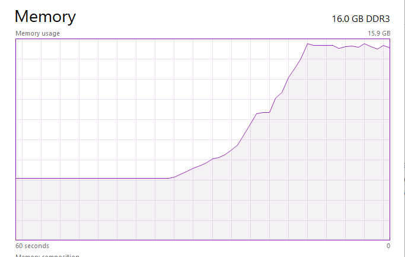

# Part 1. Reading Questions on Tensor Fields visualization

## 1
Tensors are a generalization of scalars and vectors and they describe the geometric relation between scalars and vectors. They represent properties of a physical object just like scalars and vectors. A scalar can be described as a tensor rank zero (only magnitude) and a vector can be described as a tensor rank 1 (magnitude and direction). A tensor field different from a scalar or vector field because each cell will contain multiple scalar/vector combinations to describe it.

## 2
- Box glyph: The box glyph visualizes the tensor as components of a box. The major short coming is the lack of symmetry.
- Ellipsoid glyph: The ellipsoid glyph visualizes the tensor as components of an ellipsoid. The major short coming is that intermediate states between extremes appear visually similar leading to a loss of information.
- Superquadratic glyph: The superquadratic glyph combines the strengths of the box and ellipsoid glyphs to overcome their shortcomings by visualizing the tensor as a box with rounded corners.

## 3
The challenges of tensor field visualization are to create an intuitive visualization that is visually clear of clutter. Tensors can describe a range of qualities including curvature, diffusion, and stress. These diverse situations do not lend themselves well to a single intuitive glyph such as an arrow for a vector. Despite development of the superquadratic glyph, tensor field visualizations can easily become cluttered and hard to interpret.

## 4
HyperLIC is a technique for visualizing symmetric tensor fields inspired by the line integral convolution for vector fields. The tensor field is first divided into orthogonal eigenvector fields. Then a geometric primitive, a circle or square, is placed over each location and is deformed by the field. The noise texture under each primitive is averaged together to give the pixel values for the final image. This technique provides visual insight into the anisotropic characteristics of the tensor field. 

# Part 2. Paraview

It is clear to see from this exercise that visualizing tensor fields is difficult. They are very busy and need to be observed in small sections to discern the details. For the following three visualizations, I changed the glyph parameters such as glyph size, limit scaling by eigen values, and coloring. Despite producing these visualizations, I do not know how to interpret them. This makes tensor visualizations even more difficult to work with.

## Box Glyphs

## Sphere Glyphs

## Cylinder Glyphs

## Superquadric Glyphs

I was unable to visualize superquadratic glyphs. When applying them to the tensor field, paraview quickly consumed all available system memory and became unresponsive. I attempted to produce this visualization on multiple versions of paraview.

