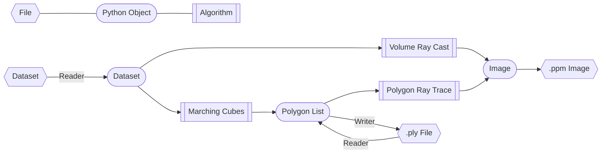

# DataViz


# Python Virtual Environments

build environment, [mac](https://github.com/pyenv/pyenv/wiki)
```bash
sudo apt-get update; sudo apt-get install make build-essential libssl-dev zlib1g-dev \
libbz2-dev libreadline-dev libsqlite3-dev wget curl llvm \
libncursesw5-dev xz-utils tk-dev libxml2-dev libxmlsec1-dev libffi-dev liblzma-dev
```

install pyenv, [mac](https://github.com/pyenv/pyenv/#homebrew-in-macos)
```bash
git clone https://github.com/pyenv/pyenv.git ~/.pyenv
cd ~/.pyenv && src/configure && make -C src && cd -
```

configure shell
```bash
# the sed invocation inserts the lines at the start of the file
# after any initial comment lines
sed -Ei -e '/^([^#]|$)/ {a \
export PYENV_ROOT="$HOME/.pyenv"
a \
export PATH="$PYENV_ROOT/bin:$PATH"
a \
' -e ':a' -e '$!{n;ba};}' ~/.profile
echo 'eval "$(pyenv init --path)"' >>~/.profile

echo 'eval "$(pyenv init -)"' >> ~/.bashrc
```

restart session (restart vscode)

install virtualenv plugin, [mac](https://github.com/pyenv/pyenv-virtualenv#installing-with-homebrew-for-macos-users)
```bash
git clone https://github.com/pyenv/pyenv-virtualenv.git $(pyenv root)/plugins/pyenv-virtualenv
echo 'eval "$(pyenv virtualenv-init -)"' >> ~/.bashrc
```

install python 3.8.13
```bash
pyenv install 3.8.13
```

create virtualenv
```bash
cd DataViz
pyenv virtualenv 3.8.13 DataViz
pyenv local DataViz
```

install project dependencies
```bash
# check python version is 3.8.13
python --version
pip install -r requirements.txt
```

# Running Algorithms
Images are produced as ppm files which can be converted with the commandline tool convert (aka imagemagick)

## volume ray cast

```bash
python volume_ray_cast.py && convert volume.ppm volume.png
```

## polygon ray trace

```bash
python polygon_ray_trace.py && convert polygon.ppm polygon.png
```

## marching cubes

```bash
python marching_cube.py # open ply file in paraview
```

## rendering pipeline

```bash
python rendering_pipeline.py && convert pipeline.ppm pipeline.png
```