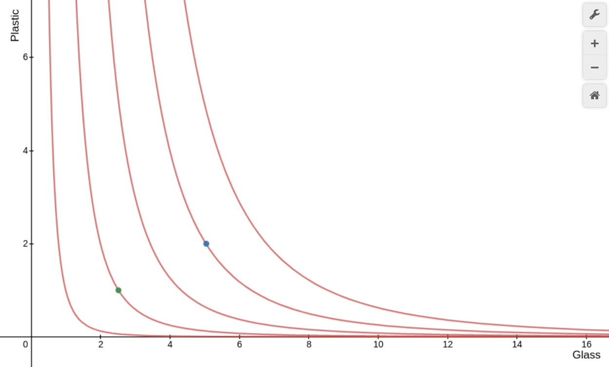

# 1.
A problem we chose was a recycling center. The decision-makers are:

* Collectors
* Sorters
* Distributors

Choices available to the decision-makers,

* Collection
  * Route planning
  * Load balancing
* Sorting
  * Classification (Glass, Plastic, Paper, Metal, etc.)
* Distribution
  * Inventory management
  * Order Fulfillment

The goals of the decision-makers:

* Collection
  * Efficiently obtaining recyclable materials
* Sorting
  * Correct identification and rejection of collected materials
  * Maximizing utilization
  * Minimizing error
* Distribution
  * Balancing supply and demand
  * Accurately filling orders

A multi-agent system is preferable to a centralized solution because if one agent were in charge of an entire recycling center they would not have enough resources to manage all the tasks.
Also, using multiple agents in each area (collection, sorting, distributing), maximizes throughput. 

# 2.

For a recycling center recycling glass and plastic, the plant can recycle glass three times more efficiently than plastic. Two parameters that can be used to assign utility are:

1. Amount of glass collected
2. Amount of plastic collected

Using the COBB Douglass utility function we can determine the marginal rate of substitution.

let $g =$ amount of glass and $p =$ amount of plastic
$$ U(g,p) = g^{.75} \cdot p^{.25} $$
$$ MRS_{gp} = \frac{.75p}{.25g} \Rightarrow \frac{3p}{1g} $$

Indifference curves:

This means that in order to obtain the same utility from one unit of glass, the recycling center would need to process three units of plastic.

