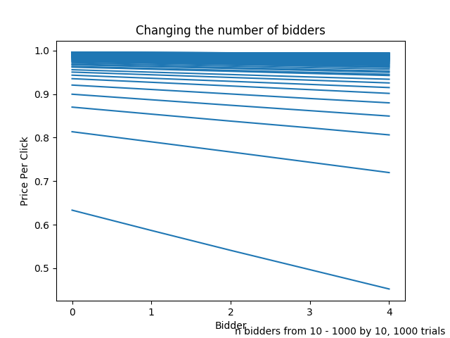
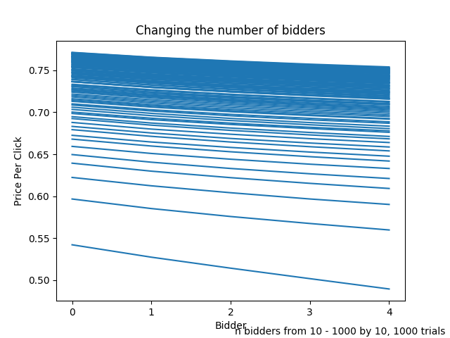
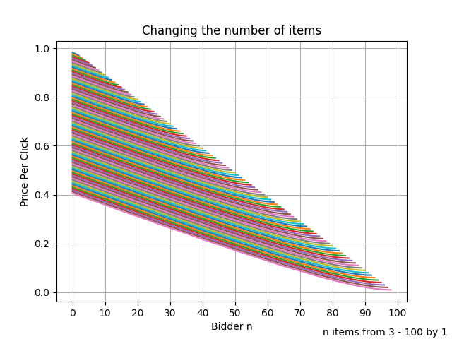
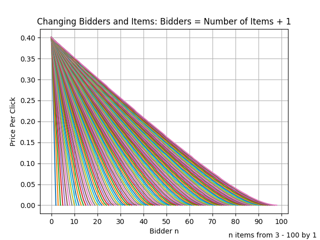
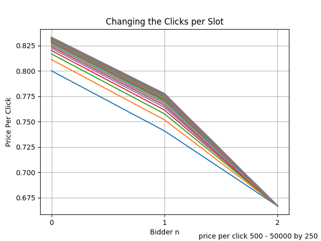
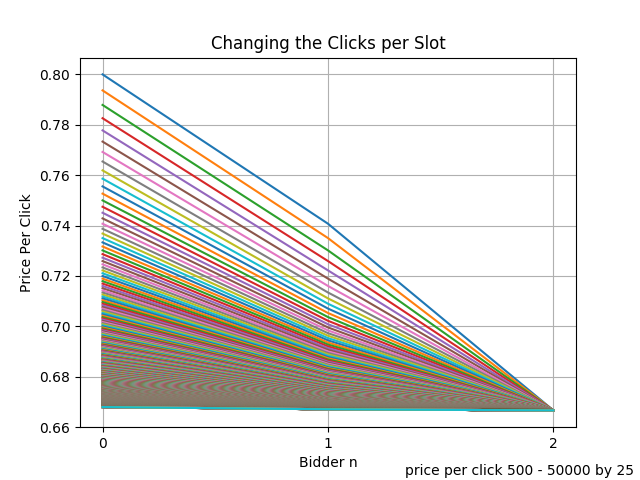
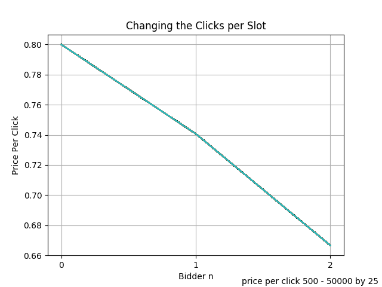

# Changing Number of Bidders (Linearly Distributed Bids)

More bidders pushed the price higher

\newpage

# Changing Number of Bidders (Normally Distributed Bids)

More bidders pushed the price higher; however, the price final price per click does not end up being as high as with the linear distribution.

\newpage

# Changing the Number of Advertising Slots, Constant Number of Bidders

More slots pushed the price lower

\newpage

# Changing the Number of Advertising Slots While Increasing Bidders

More items and bidders pushed the price higher
for the $i^{th}$ bidder : $0\leq i < n$.

\newpage

# Changing the Number of Clicks per Slot

The price per click goes from $high$ to $low$, where $high$ goes from $500$ to $50000$ by $250$, and $low = 100$. When the $low$ remained constant and the $high$ increased, the price per click increased for the $i^{th}$ bidder : $0\leq i < n$.

\newpage

# Changing the Number of Clicks per Slot

The price per click goes from $high$ to $low$, where $high$ goes from $500$ to $50000$ by $25$, and $low = high-400$. When the $low$ remained a constant amount lower than the $high$, the price decreased for the $i^{th}$ bidder : $0\leq i < n$.

\newpage

# Changing the Number of Clicks per Slot

The price per click goes from $high$ to $low$, where $high$ goes from $500$ to $50000$ by $25$, and $low = \frac{high}{5}$. When the $low$ remained a proportional amount lower than the $high$, the price per click remained the same for the $i^{th}$ bidder.

