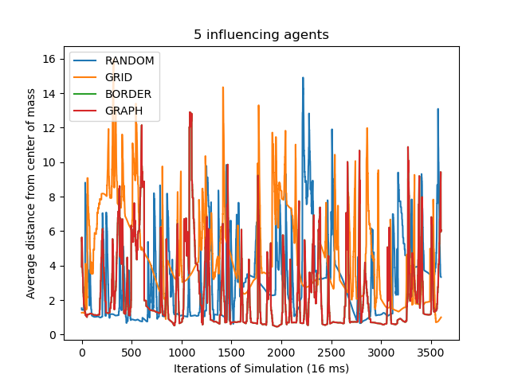
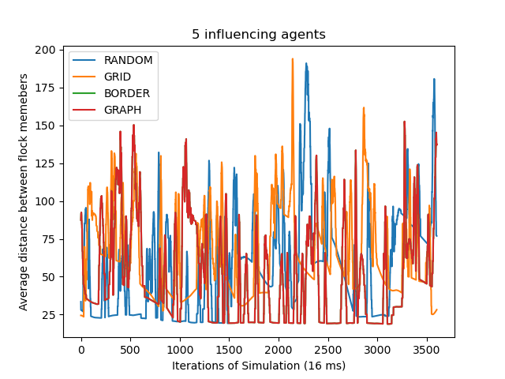
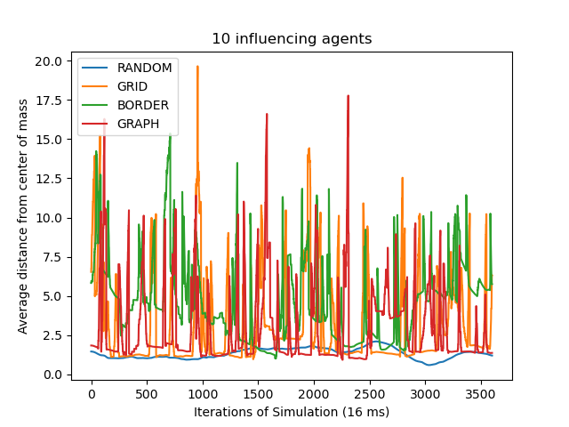
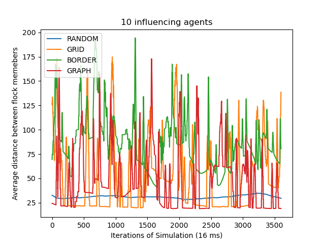
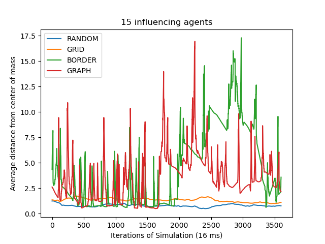
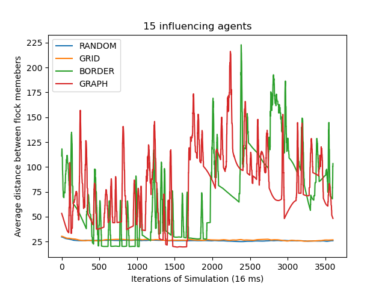
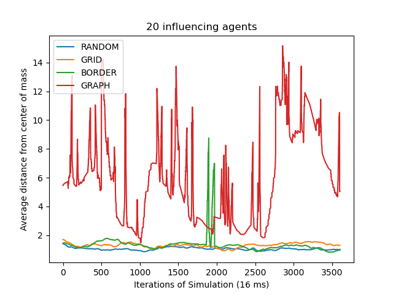
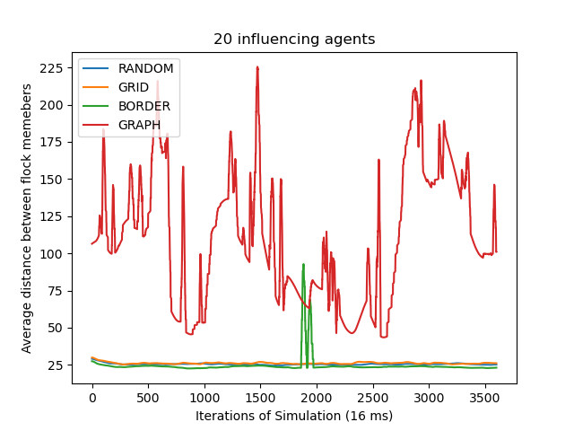
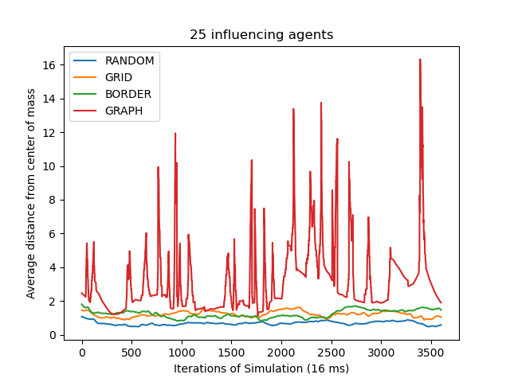
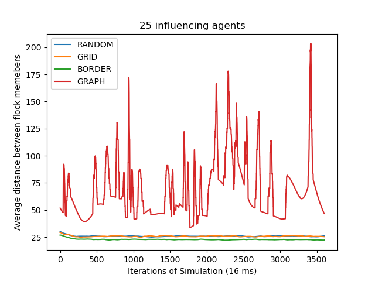

# Abstract

Flocking is a multi agent behavior naturally exhibited by many different animals including birds, fish, insects, herds of land animals and many more. Although flocking may look like a complex orchestration of tens or millions of individuals, it is the simple result of each individual reacting to its own local environment. Previous work has been done to study influencing flocks through carefully placed "influencing agents". [2] Influencing agents can be used to direct a flock of agents despite only controlling a small fraction of the flock. In this paper, I look at the placement methods previously proposed and measure how they impact flock density. I cover random, grid, border, and graph placement as described by Dr. Katie Genter. [2]

# Introduction

Flocking is an emergent behavior based in a simple set of governing rules that are followed by each flock member. From these simple rules, much like Conway's Game of Life, can emerge complex and lifelike simulations. If we are able to place convincing agents which are under our control into a flock, they would be able influence the whole flock with minimal effort. By understanding the rules that govern flocks, we can use influencing agents to help them and us.

The motivation for influencing a flock could be to protect the flock or protect ourselves. This technique could be used to place a few influencing agents, maybe in the form of robotic flock members, in a flock of birds that is heading towards a wind farm or oil spill in order to guide them safely away from the hazard. Using influencing agents would allow us to do this in a minimally invasive way without the need to capture or forcibly remove the flock. I though it would be interesting to measure which flock placement method, random, grid, border or graph, leads to a more compact or sparse flock. Then we could know if our placement method would increase the flock size which might be detrimental to achieving our goal while influencing the flock.

# Previous Work

In my experiment, I will use the basic boid flocking model described by Craig Reynolds [1]. In his paper, Reynolds gives the following three rules for flock members to follow.

1. Collision Avoidance: avoid collisions with nearby flockmates
2. Velocity Matching: attempt to match velocity with nearby flockmates
3. Flock Centering: attempt to stay close to nearby flockmates 

Each member of the flock is able to see nearby flockmates within a visual radius $r$. Scientists, aided by high speed cameras, have observed and modeled flocks of birds and have confirmed that these basic rules generally hold with some caveats. [4] The flock centering rule usually applies to the nearest 5-10 neighbors of each flock mate and is independent of the distance between these neighbors and the flock member. Additionally there is a stronger tendency to stay close to flockmates which are to the side of the flock member as opposed to in front, behind, above or below, likely due to the field of view seen by a bird.

The four placement methods I will use are described by Dr. Genter in her dissertation: random placement, grid placement, border placement, and graph placement. [3] Random placement places $k$ influencing agents randomly within the flock. Grid placement uses an evenly spaced grid to place $k$ influencing agents throughout a flock. The border placement method puts agents around the perimeter such that at most $\left\lceil\frac{k}{4}\right\rceil$ agents are placed on a side. 

These placement methods are straight forward and Genter shows that they have some success influencing the flock. The more interesting method for influencing a flock is graph placement. In this method, a graph is used to represent the flock. Each natural, non-influencing, member of the flock is added to the graph and undirected edges are placed between members to represent the Cartesian distance between them. Since each member of the flock has a limited visibility radius, $r$, influencing agents are placed at the midpoint between flock members where the edge between them is at most $2r$ and maximizing the number of flock members who can see an influencing agent. This way, the influencing agent can influence both neighbors and potentially other flock members. In the case that there are no $2r$ edges, the agents are place such that they are in the vicinity of one other flock member.

# My contribution
I have implemented two metrics to measure flock density as a function of the position of flock members and simulated the four placement methods: random, grid, border, and graph, in order to determine the effect of the influencing agents on the flock's density. Method A measures the average distance from flock members to the flock center of mass and method B measures the average distance between flock members. Although I did not experiment with different flock sizes, method A would be influenced by the flock size while method B should not. Because flock members must distance them selves from their neighbors, larger flocks would result in larger average distances from the flock center of mass. On the other hand, method B would only be influenced by the collision avoidance parameter of the flocking rules. With both methods, lower values reflect a more dense flock.

I expected to see that the border placement method would have the greatest capacity for compacting the flock and increasing flock density. Conversely, I expect that the graph placement method would have the greatest capacity for expanding the flock and decreasing flock density. I found that random placement had greatest power to control the flock and increase flock density and that the graph placement could not control the flock and had the lowest flock density.

# Experimental Design:

In order to test my hypothesis and obtain these results, I wrote a simulation based on the basic boid flock model previously discussed. The final simulation is written in python and a version without influencing agents written in JavaScript is available here [https://philipnelson5.github.io/Boids_ts/](https://philipnelson5.github.io/Boids_ts/) that can be viewed in a web browser.

The boids are generated and placed in the world with a position and velocity. Then, each iteration of the simulation each boid determines which other boids are within it's visual radius, $r$, and within $\theta$ of it's own velocity. This keeps boids from seeing every single other boid and boids that are directly behind itself. Next, for each boid in it's field of view, it adjusts it's velocity vector in order to avoid any boid that is too close to it. Then it adjusts it's velocity vector to align itself with the velocities of the boids it can see. Next it updates its velocity to point towards the center of mass of the boids it can see. Finally, with the new velocity vector, it moves forward.

With each of the rules that the boid follows, there are strength parameters that change how much its velocity vector is updated for that rule. This way more emphasis can be placed on velocity alignment or collision avoidance. Adjusting these parameters in real time gives a good feeling for how they impact the behavior of the boids and the emergent behavior of the flock.

The first iteration of the boid simulation was limited in scope but provides a convincing looking flock without influencing agents. The world that the boids inhabit is a toroid so boids that exit any side are teleported to the opposite side. Since the world was devoid of obstacles, the boid have no obstacle avoidance and only seek to adhere to the three rules collision avoidance, velocity matching, and flock centering. The world is relatively small, being 1500 units by 1000 units and boids attempt to maintain 25 units of distance between them. Part of my future work will be to improve the base simulation; this is discussed in a later section.

Due to the limitations of the simulated world, the influencing agents were given a predetermined path described by a circle at the center of the world with a radius of about 400 units. This kept the influencing agents from exiting the sides of the world hopefully giving the rest of the flock the best opportunity to flock with them.

I implemented two metrics for measuring density, method A: average distance from the center of mass, and method B: average distance between boids. Method A is obtained by calculating the center of mass for the flock, not including the flocking agents, and then calculating the average distance between each member of the flock and the center of mass.

Method B is obtained by calculating the distance between each flock member and dividing by the number of flock members squared to obtain the average distance between flock members.

# Results:

During the initial implementation of the flocking simulation, the results were looking really good. I was able to implement the basic rules for the flock and I was able to run the simulation in real time at 60 frames a second with 100 boids. The boids were forming flocks and displayed very interesting and emergent flock behavior as I had expected. After building out the JavaScript version I was easily able to add sliders to adjust the rule parameters in real time to see how they affect the flock. It was fascinating to see how these three simple rules were able to create such interesting and complex behavior. 

Next I added influencing agents and quickly realized that the simulation I had developed was not providing the results I had hoped for. Although the flock saw the influencing agents as regular members of the flock, the influencing agents were not having having a strong enough pull on them to keep the flock together. I suspect that this is due to the fact that the influencing agents were making very sharp turns relative to the uninfluenced movement of the flock, therefore the velocity alignment rule was not strong enough to keep the flock together.

Dialing up the velocity alignment parameter did have the effect of keeping the flock together however I felt it was likely too strong to be representative of the real world. The other way I was able to keep the flock together was to add more and more influencing agents. By their sheer numbers they influenced the average enough to keep the flock moving the same direction but this defeated the purpose of the influencing agents, to influence the flock with relatively small number of influencing agents relative to the number of flock members.

The following graphs show the result of simulating a flock of 30 members and increasing the numbr of influencing agents from 5 to 25. Each of the four placement methods are represented. The Y axis is either method A or B for measuring density, where smaller numbers represent a denser flock. The X axis is the iteration of the simulation where the time between steps is 16 milliseconds. Each simulation was run 3600 steps with would be approximately one minute.

{width=25%}\ {width=25%}
{width=25%}\ {width=25%}
{width=25%}\ {width=25%}
{width=25%}\ {width=25%}
{width=25%}\ {width=25%}

Surprisingly random placement did the best job of increasing the flock density followed closely by grid placement. The results show that the graph approach produced the least dense flocks but this is because my graph placement method was unable to keep the flock together. The jagged features in the graphs are formed when flock members teleport to the other side of the world causing discontinuous movement of the center of mass and resulting averages. ([talk about how many boids are in this simulation]). We can see that the graph approach never loses these jagged features which means that he boids do not form a cohesive flock.

# Future Work

Going forward there are a few areas I will focus on to improve the simulation and one other area of additional research related to flock density I will explore. In order to improve the simulation I will begin by increasing the size of the world so that there will be more space for the boids to fly without the need of a toroidal world. Since the world will be flat, I will add an object avoidance phase to their velocity update in order to keep them from flying into the edges of the world. 

With the larger world, the influencing agents will be able to have a more subtle path to influence the flock with will require less change in velocity per update. This will allow the influencing agents to influence the flock without the need for super strong velocity alignment parameters or massive numbers.

Another interesting idea proposed in Reynolds' original paper on flocking is called deals with arbitrating independent behaviors. [1] With the increasing number of rules, how does the boid know which one to listen to the most and at which time? A worst case example would be three boids flying in a line and approaching an obstacle. For the boid in the middle, its neighbors exert equal force on it to stay flying in a straight line right into the obstacle. With out a way to prioritize object avoidance, it will hesitate and likely hit the obstacle. 

Reynolds solution to this dilemma is to put the rules in priority order. Then have a maximum amount of influence that can be accumulated each cycle of the simulation. When that maximum is reached, the other rules are skipped. This way the boid can prioritize avoiding the obstacle and the boids around it can react to its sideways movement.

To address the grid placement method, one aspect that I did not implement was to minimize the number of boids that do not see an influencing agent. By only maximizing the number of boids that are seen by an influencer, they tend to be grouped towards the center of the flock where they are seen the most. This leaves the boids on the outside further away from an influencer and therefore they receive less influence.

The further are of research I think would be interesting to pursue is density influencing. Once it is determined which methods make more or less dense flocks, it would be interesting to see if the influencing agents could be given a path to follow which makes the flock even more or less dense.

# References

[1] C. W. Reynolds. Flocks, herds and schools: A distributed
behavioral model. SIGGRAPH, 21:25–34, August 1987.

[2] K. Genter, S. Zhang, and P. Stone. Determining placements of influencing agents in a flock.
In Proceedings of the 2015 International Conference on Autonomous Agents and Multiagent
Systems (AAMAS’15), pages 247–255. International Foundation for Autonomous Agents and
Multiagent Systems, May 2015.

[3] K. Genter. Fly with Me: Algorithms and Methods for Influencing a Flock [Doctoral dissertation] The University of Texas at Austin. repositories.lib.utexas.edu, August 2017

[4] T. Feder. "Statistical physics is for the birds". Physics Today. 60 (10): 28–30. doi:10.1063/1.2800090, October 2007
