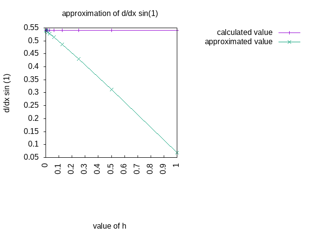
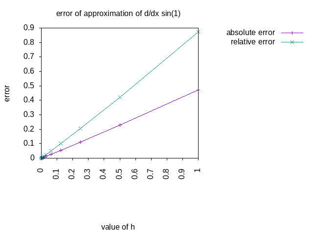
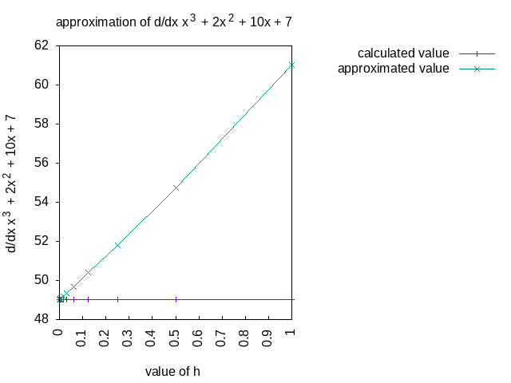
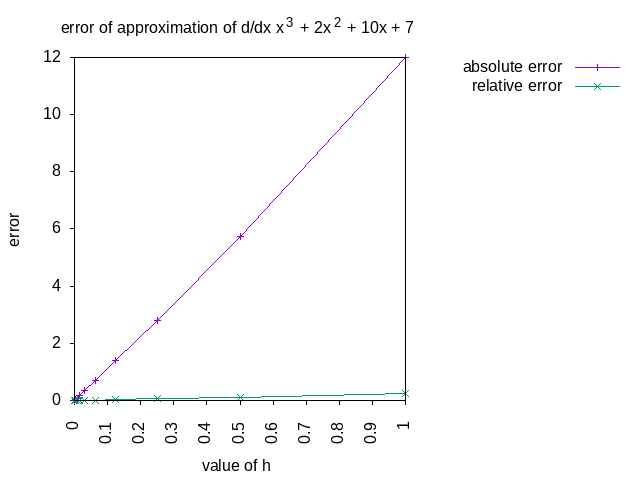


<a href="https://philipnelson5.github.io/math4610/SoftwareManual"> Table of Contents </a>
# Derivative Approximation Software Manual

**Routine Name:** deriv_approx

**Author:** Philip Nelson

**Language:** C++. The code can be compiled using the GNU C++ compiler (gcc). A make file is included to compile an example program

For example,

```
make
```

will produce an executable **./release.out** that can be executed.

**Description/Purpose:** This routine approximates the derivative of a function \\(f\\). The approximation of the derivative \\[\frac{d}{dx} f(x) \approx \frac{f(x+h) - f(x)}{h}\\] is used in the routine.

**Input:** There are three inputs, a function, the location to approximate the derivative, and the h to use in the approximation.

```
@tparam T The type of x, h, and the function f's param and return
@param f  The T(T) function to approximate
@param x  The point to approximate the function at
@param h  The value of h to use in the approximation
```

**Output:** The approximation of the function `f` at `x` using `h` in the equation above.

**Usage/Example:**

``` c++
int main()
{
  auto x = 1.0;
  auto h = .25;
  auto value = cos(x);
  auto f = sin;
  auto approx = deriv_approx(f, x, h);
  std::cout << approx << std::endl;
}
```

**Output** from the lines above
```
0.4300545382
```

_explanation of output_:
The routine output the approximation of the derivative of \\(sin(x)\\) at \\(x=1\\) using \\(h=.25\\). The correct value should be \\(cos(1) = 0.5403023059\\)

**Implementation/Code:** The following is the code for deriv_approx

``` c++
template <typename T, typename F>
T deriv_approx(F f, T x, T h)
{
  return (f(x + h) - f(x)) / h;
}
```

---
**Experimentation**

The first function tested was \\(\frac{d}{dx}sin(x)\\) at \\(x=1\\). Below are the results:

```
       h         d/dx sin(1)    approx     Error Abs       Error Rel
-------------------------------------------------------------------------
1               0.5403023059 0.0678264420 0.4724758639    0.874465755
0.5             0.5403023059 0.3120480036 0.2282543023    0.4224566503
0.25            0.5403023059 0.4300545382 0.1102477677    0.2040483013
0.125           0.5403023059 0.4863728743 0.05392943154   0.09981343954
0.0625          0.5403023059 0.5136632057 0.02663910012   0.04930406521
0.03125         0.5403023059 0.5270674561 0.01323484972   0.02449526789
0.015625        0.5403023059 0.5337064629 0.00659584301   0.01220768992
0.0078125       0.5403023059 0.5370098303 0.003292475538  0.006093765477
0.00390625      0.5403023059 0.5386574359 0.001644869986  0.003044351224
0.001953125     0.5403023059 0.5394802136 0.0008220922623 0.00152154128
0.0009765625    0.5403023059 0.5398913455 0.0004109603504 0.0007606118759
0.00048828125   0.5403023059 0.5400968472 0.0002054587178 0.0003802662242
0.000244140625  0.5403023059 0.5401995819 0.000102723993  0.0001901231807
0.0001220703125 0.5403023059 0.5402509452 5.136065484e-05 9.505910724e-05
6.103515625e-05 0.5403023059 0.5402766259 2.567999236e-05 4.75289335e-05
3.051757812e-05 0.5403023059 0.540289466  1.283991169e-05 2.376431037e-05
1.525878906e-05 0.5403023059 0.5402958859 6.419934111e-06 1.188211496e-05
7.629394531e-06 0.5403023059 0.5402990959 3.209956235e-06 5.941037452e-06
3.814697266e-06 0.5403023059 0.5403007009 1.604967296e-06 2.970498699e-06
1.907348633e-06 0.5403023059 0.5403015034 8.024873792e-07 1.485256255e-06
9.536743164e-07 0.5403023059 0.5403019047 4.012037649e-07 7.42554234e-07
4.768371582e-07 0.5403023059 0.5403021052 2.006201654e-07 3.713109553e-07
2.384185791e-07 0.5403023059 0.5403022054 1.005029886e-07 1.86012511e-07
1.192092896e-07 0.5403023059 0.5403022561 4.974590828e-08 9.207050894e-08
5.960464478e-08 0.5403023059 0.5403022803 2.553152134e-08 4.7254141e-08
2.980232239e-08 0.5403023059 0.5403022952 1.063036015e-08 1.967483765e-08
1.490116119e-08 0.5403023059 0.540302299  6.905069849e-09 1.278001181e-08
7.450580597e-09 0.5403023059 0.5403023064 5.455107477e-10 1.009639866e-09
3.725290298e-09 0.5403023059 0.5403023064 5.455107477e-10 1.009639866e-09
```

Here are graphs of the real vs the approximate solution, and the errors




---

The second function tested was \\(x^3 + 2x^2 + 10x + 7\\) at \\(x=3\\). Below are the results:

```
       h         d/dx f(3)      approx      Error Abs       Error Rel
-------------------------------------------------------------------------
1                    49       61          12              0.2448979592
0.5                  49       54.75       5.75            0.1173469388
0.25                 49       51.8125     2.8125          0.05739795918
0.125                49       50.390625   1.390625        0.02838010204
0.0625               49       49.69140625 0.69140625      0.01411033163
0.03125              49       49.34472656 0.3447265625    0.007035235969
0.015625             49       49.17211914 0.1721191406    0.003512635523
0.0078125            49       49.08599854 0.08599853516   0.001755072146
0.00390625           49       49.04298401 0.04298400879   0.0008772246692
0.001953125          49       49.02148819 0.0214881897    0.0004385344836
0.0009765625         49       49.01074314 0.01074314117   0.0002192477791
0.00048828125        49       49.00537133 0.005371332169  0.0001096190238
0.000244140625       49       49.00268561 0.00268560648   5.48082955e-05
0.0001220703125      49       49.00134279 0.001342788339  2.740384365e-05
6.103515625e-05      49       49.00067139 0.000671390444  1.37018458e-05
3.051757812e-05      49       49.00033569 0.0003356942907 6.850903892e-06
1.525878906e-05      49       49.00016785 0.0001678466797 3.425442443e-06
7.629394531e-06      49       49.00008392 8.392333984e-05 1.712721221e-06
3.814697266e-06      49       49.00004196 4.196166992e-05 8.563606107e-07
1.907348633e-06      49       49.00002098 2.098083496e-05 4.281803053e-07
9.536743164e-07      49       49.00001049 1.049041748e-05 2.140901527e-07
4.768371582e-07      49       49.00000525 5.24520874e-06  1.070450763e-07
2.384185791e-07      49       49.00000262 2.62260437e-06  5.352253817e-08
1.192092896e-07      49       49.00000131 1.311302185e-06 2.676126908e-08
5.960464478e-08      49       49.00000072 7.152557373e-07 1.459705586e-08
2.980232239e-08      49       49          0               0
1.490116119e-08      49       49          0               0
```




**Last Modified:** September 2018
