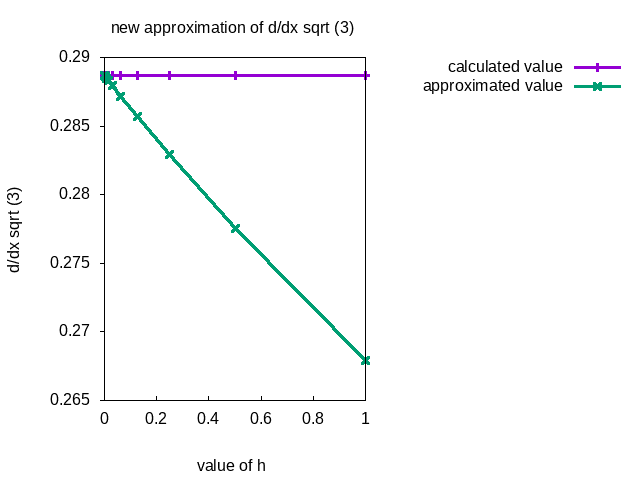


<a href="https://philipnelson5.github.io/math4610/SoftwareManual"> Table of Contents </a>
# Problem 3

**Author:** Philip Nelson

**a.**

\\[\frac{d}{dx} \sqrt{x}\\]

\\[=\frac{\sqrt(x+h)-\sqrt(x)}{h}\\]

\\[=\frac{\sqrt(x+h)-\sqrt(x)}{h} \cdot \frac{\sqrt(x+h)+\sqrt(x)}{\sqrt(x+h)+\sqrt(x)}\\]

\\[=\frac{x+h-x}{h(\sqrt{x+h}+\sqrt{x})}\\]

\\[=\frac{h}{h(\sqrt{x+h}+\sqrt{x})}\\]

\\[=\frac{1}{\sqrt{x+h}+\sqrt{x}}\\]

**Original Approximation**
\\[\frac{d}{dx} \sqrt{x} = \frac{\sqrt(x+h)-\sqrt(x)}{h}\\]

**New Approximation**
\\[\frac{d}{dx} \sqrt{x} = \frac{1}{\sqrt{x+h}+\sqrt{x}}\\]

**b.**
Using the difference \\[\frac{d}{dx} f(x) = \frac{f(x+h)-f(x)}{h}\\] where \\(f(x) = \sin(x)\\) at \\(x_0 = 0\\) and using the Taylor series expansion for \\(\sin(x)\\) \\[\sum_{k=0}^5 \frac{(-1)^k}{(2k+1)!}x^{2k+1}\\] the following graphs were produced to visualize the value of the derivative and the associated error.

**Last Modified:** September 2018
