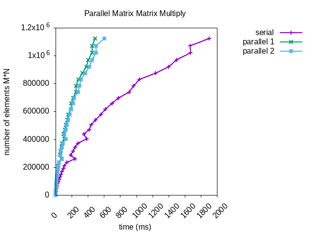


<a href="https://philipnelson5.github.io/math4610/SoftwareManual"> Table of Contents </a>
# Parallel Matrix Matrix Multiply

**Author:** Philip Nelson

**Language:** C++. The code can be compiled using the GNU C++ compiler (gcc)

**Description/Purpose:** This page demonstrates the utility of OpenMP in parallelization.

**Findings**



These results are impressive for the low amount of work that is required to utilize OpenMP directives. We can see that both parallel methods outperform the serial version. With the largest matrices the first parallel function outperforms the second.

**Implementation/Code:** The following is the code for parallel_multiply

Two versions were tested. Version one used `#pragma omp for` to parallelize the outer for loop. Version 2 used `#pragma omp for collapse(3)` to parallelize the outer and inner loops. 

``` cpp
template <typename T>
using Matrix = std::vector<std::vector<T>>;

template <typename T, typename U, typename R = decltype(T() + U())>
Matrix<R> parallel_multiply(Matrix<T> const& m1, Matrix<U> const& m2)
{
  if (m1[0].size() != m2.size())
  {
    std::cerr << "ERROR: incorrectly sized matrices in parallel mat * mat\n";
    exit(EXIT_FAILURE);
  }

  Matrix<R> result(m1.size());
  std::for_each(begin(result), end(result), [&m2](std::vector<R>& row) {
    row.resize(m2[0].size());
  });

#pragma omp parallel
  {
#pragma omp for
    for (auto i = 0u; i < result.size(); ++i)
    {
      for (auto j = 0u; j < result[0].size(); ++j)
      {
        result[i][j] = 0;
        for (auto k = 0u; k < m2.size(); ++k)
        {
          result[i][j] += m1[i][k] * m2[k][j];
        }
      }
    }
  }

  return result;
}

template <typename T, typename U, typename R = decltype(T() + U())>
Matrix<R> parallel_multiply2(Matrix<T> const& m1, Matrix<U> const& m2)
{
  if (m1[0].size() != m2.size())
  {
    std::cerr << "ERROR: incorrectly sized matrices in parallel mat * mat\n";
    exit(EXIT_FAILURE);
  }

  Matrix<R> result(m1.size());
  std::for_each(begin(result), end(result), [&m2](std::vector<R>& row) {
    row.resize(m2[0].size(), 0);
  });

#pragma omp parallel
  {
#pragma omp for collapse(3)
    for (auto i = 0u; i < result.size(); ++i)
    {
      for (auto j = 0u; j < result[0].size(); ++j)
      {
        for (auto k = 0u; k < m2.size(); ++k)
        {
          result[i][j] += m1[i][k] * m2[k][j];
        }
      }
    }
  }

  return result;
}
```

**Last Modified:** <++>September 2018
