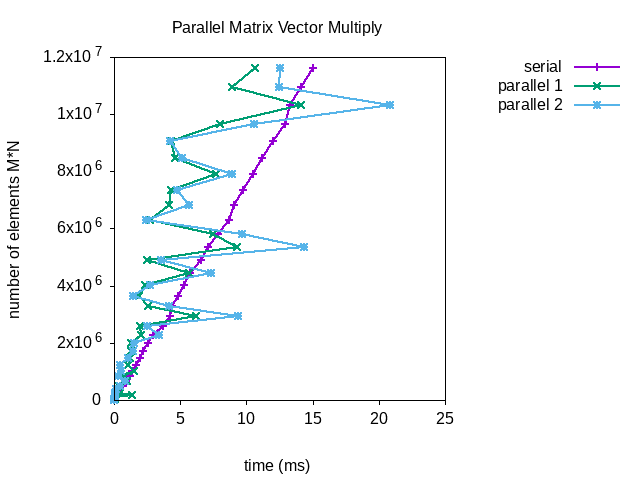


<a href="https://philipnelson5.github.io/math4610/SoftwareManual"> Table of Contents </a>
# Parallel Matrix Vector Multiply

**Author:** Philip Nelson

**Language:** C++. The code can be compiled using the GNU C++ compiler (gcc)

**Description/Purpose:** This page demonstrates the utility of OpenMP in parallelization.

**Findings**



These results are impressive overall but there are some anomalies. I don't know why it takes the parallel functions longer sometimes. We can see that both parallel methods outperform the serial version. With the largest matrices the first parallel function outperforms the second.

**Implementation/Code:** The following is the code for parallel_multiply

Two versions were tested. Version one used `#pragma omp for` to parallelize the outer for loop. Version 2 used `#pragma omp for collapse(2)` to parallelize the outer and inner loops. 

``` cpp
template <typename T>
using Matrix = std::vector<std::vector<T>>;

template <typename T, typename U, typename R = decltype(T() + U())>
std::vector<R> parallel_multiply(Matrix<T> const& m, std::vector<U> const& v)
{
  if (m[0].size() != v.size())
  {
    std::cerr
      << "ERROR: incorrectly sized matrix or vector in parallel mat * vec\n";
    exit(EXIT_FAILURE);
  }

  std::vector<R> result(m.size(), 0);

  auto i = 0u, j = 0u;
#pragma omp parallel
  {
#pragma omp for
    for (i = 0u; i < m.size(); ++i)
    {
      for (j = 0u; j < m[0].size(); ++j)
      {
        result[i] += m[i][j] * v[j];
      }
    }
  }

  return result;
}

template <typename T, typename U, typename R = decltype(T() + U())>
std::vector<R> parallel_multiply2(Matrix<T> const& m, std::vector<U> const& v)
{
  if (m[0].size() != v.size())
  {
    std::cerr
      << "ERROR: incorrectly sized matrix or vector in parallel mat * vec\n";
    exit(EXIT_FAILURE);
  }

  std::vector<R> result(m.size(), 0);

  auto i = 0u, j = 0u;
#pragma omp parallel
  {
#pragma omp for collapse(2)
    for (i = 0u; i < m.size(); ++i)
    {
      for (j = 0u; j < m[0].size(); ++j)
      {
        result[i] += m[i][j] * v[j];
      }
    }
  }

  return result;
}
```

**Last Modified:** October 2018
