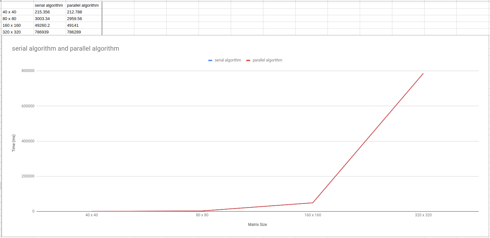


<a href="https://philipnelson5.github.io/math4610/SoftwareManual"> Table of Contents </a>
# Contents Number Test Software Manual

**Name:** Condition Number Test

**Author:** Philip Nelson

**Language:** C++. The code can be compiled using the GNU C++ compiler (gcc). A make file is included to compile an example program

For example,

```
make
```

will produce an executable **./conditionTest.out** that can be executed.

**Description/Purpose:** The purpose of this code is to test the performance of the parallel vs serial algorithm to compute the condition number of a matrix, A.

**Usage/Example:**

``` cpp
int main()
{
  for (auto i = 40u; i <= 640u; i *= 2)
  {
    auto A = generate_square_symmetric_diagonally_dominant_matrix(i);

    auto start = std::chrono::high_resolution_clock::now();
    auto conditionNum1 = condition_2_estimate(A, 50u);
    auto end = std::chrono::high_resolution_clock::now();
    auto result1 =
      std::chrono::duration<double, std::milli>(end - start).count();

    start = std::chrono::high_resolution_clock::now();
    auto conditionNum2 = parallel_condition_2_estimate(A, 50u);
    end = std::chrono::high_resolution_clock::now();
    auto result2 =
      std::chrono::duration<double, std::milli>(end - start).count();

    std::cout << i << " x " << i << std::endl;
    std::cout << "serial algorithm:\n  result: " << conditionNum1
              << "\n  time: " << result1 << std::endl
              << std::endl;

    std::cout << "parallel algorithm:\n  result: " << conditionNum2
              << "\n  time: " << result2 << std::endl
              << std::endl;
  }
}
```

**Output** from the lines above



_explanation of output_:

The results were not greatly in favor of the parallel algorithm. Both algorithms performed similarly with the parallel version outperforming the serial version by a small margin. The graph shows how the time increases exponentially as is to be expected. The marginal performance grain is not to be expected. Something is likely incorrect.

**Last Modified:** December 2018
